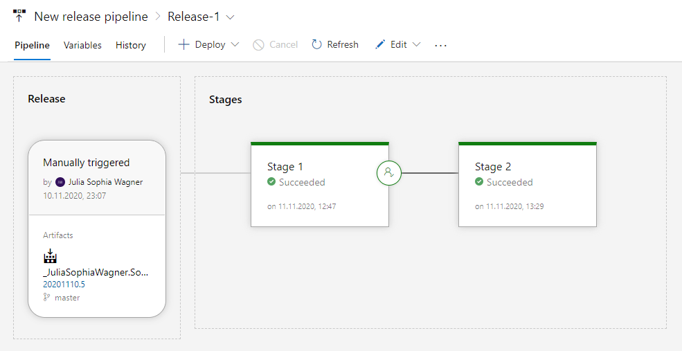
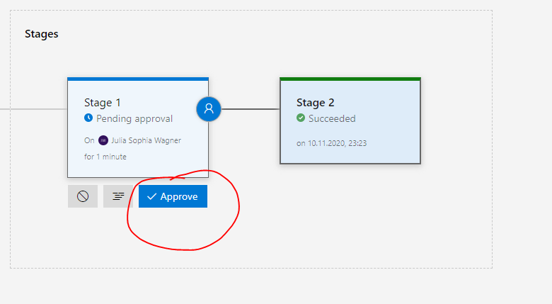
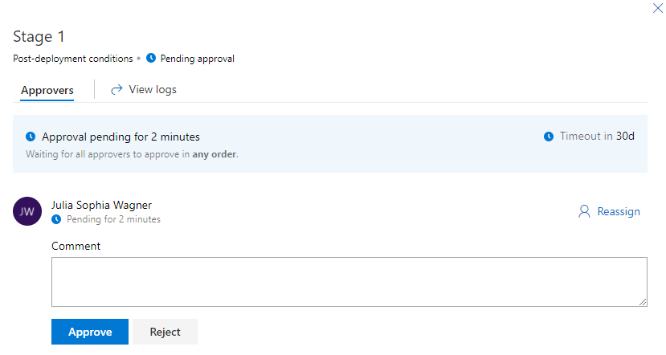
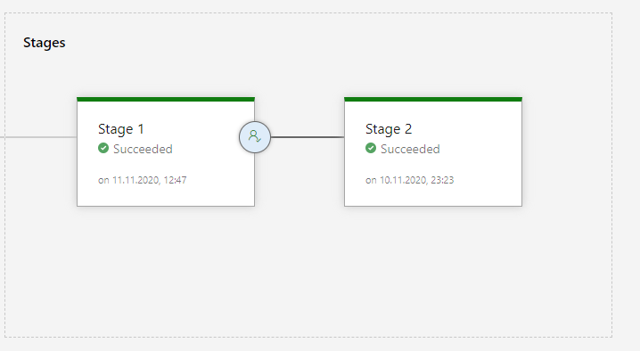

# Software Deployment - Lab 2
A Node.JS application was built using Express.
This will be deployed using an Azure DevOps pipeline in an Azure Web App after each commit. 
The Node.JS application was also equipped with test cases. 
Furthermore a release pipeline was created, which automatically ensures the adoption of a release in production, this was equipped with a manual check to avoid being published after each build.
Finally, Azure Application Insights was also integrated.

#### NodeJS application
The NodeJS application can be found in the main folder **Software Deployment** under **WebApp** as **index.js**, this calls **index.jade** for visualization in the underlying **Views** folder. 

#### Link to the Azure Web Apps
* dev (called Stage 1 in the release pipeline): 
  * http://lab1wagnerjuliasophia.azurewebsites.net/
* production: (called Stage 2 in the release pipeline)
  * http://lab2wagnerjuliasophia.azurewebsites.net/

#### Screenshot Azure DevOps build/Test/Deploy Pipeline

#### Screenshot der Azure DevOps Release Pipeline

##### How will the releases be approved?
First when you go below the Release interface it looks like this, here you can click on Approve to manually confirm that it can be re-deployed in Stage 2. 

After clicking Approve, a window appears. The next image shows this window.
Here you can enter a comment and then click Approve to confirm it.

After approving, the webapp is deployed in Stage 2 and the stages should look like this.

The rights to approve are currently only assigned to my account, but other people can be added here as well. 