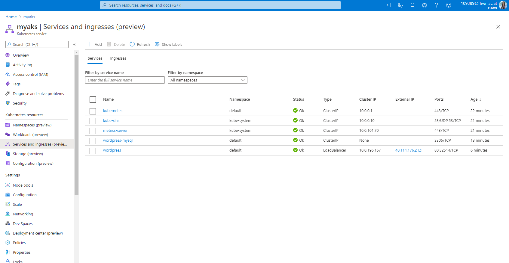

# Software Deployment - Lab 4
The task was the setup and configuration of an AKS in Azure and also the configuration and deployment of Wordpress including MySQL in the AKS cluster. 

* First you have to login in the terminal with the command `az login`.
* Afterwards the yaml files for mysql and wordpress were created.
* Then a new resource group had to be created with the `create ressoruce group wagnergroup az group create --name wagnergroup --location westeurope --generate--ssh-keys` command.
Here "--generate --ssh-keys" had to be added at the end, because an error message with "An RSA key file or key value must be supplied to SSH Key Value. You can use --generate --ssh-keys to let CLI generate one for you" during the next command. 
* After that the Kubernetes service was created with `az aks create -g wagnergroup -n myaks --node-count 1 --generate--ssh-keys`.
* The next step was to switch to the Azure Portal and open the Bash.
* First you have to upload the two yaml files.
*  The next thing to do was to log into the bash with the following commands: 
  * `az account set --subscription [subscriptionid]`
  * `az aks get-credentials --resource-group wagnergroup --name myaks`
* The last step is to apply the yaml files:
  * `kubectl apply -f /home/wagner/mysql-deployment.yaml`
  * `kubectl apply -f /home/wagner/wordepress-deployment.yaml`
* Now you could look at the external ip address under `kubectl get services` and use it. After that you will see that it works.

IP-Address: 40.114.176.2

